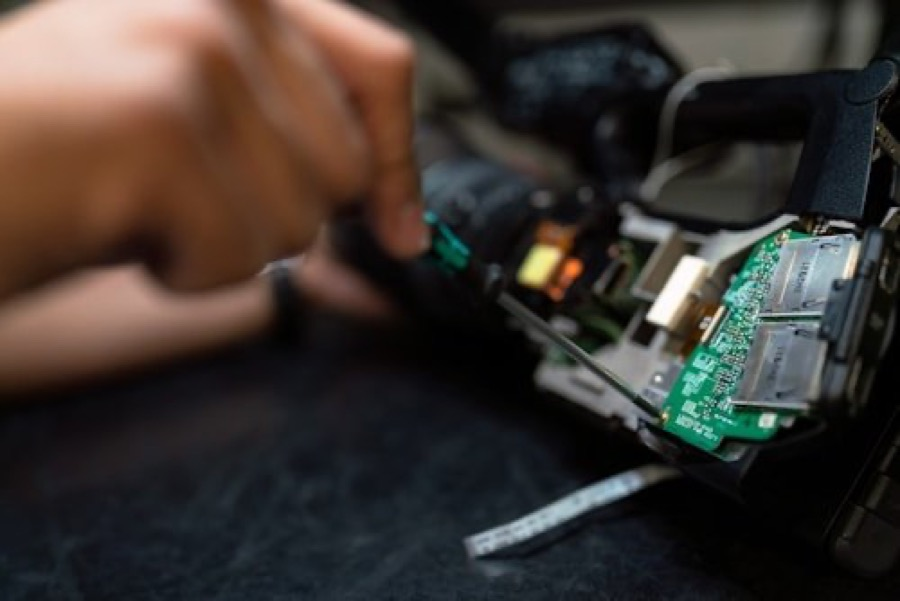
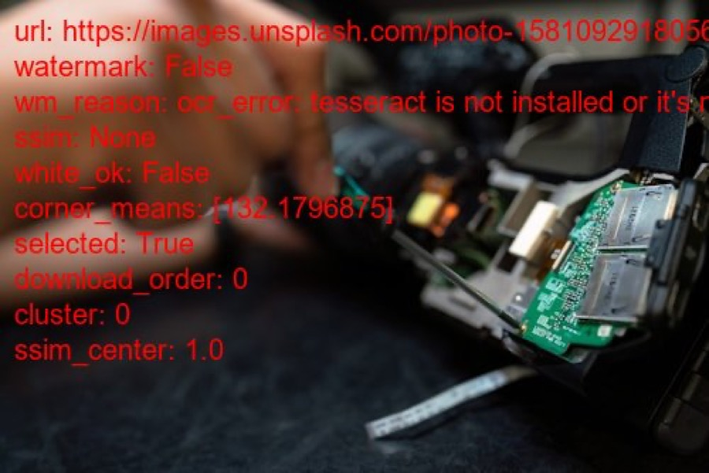
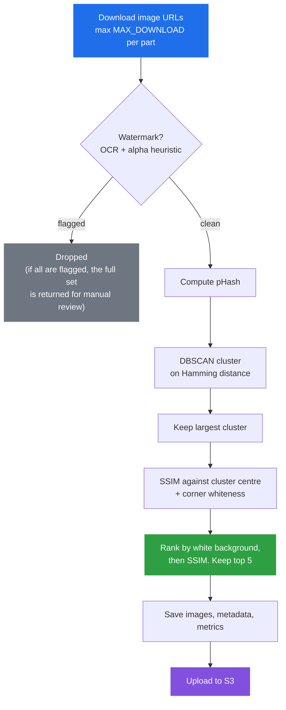

# Image Analyzer

Filters, deduplicates and clusters product images before they reach a catalogue.

[](LICENSE)
[](https://github.com/FETKlOkAn2/Image-Analyzer/actions/workflows/ci.yml)
[](https://www.python.org/)

A supplier sends you twelve URLs for one part number. Six are the same photo at
different resolutions, two carry a watermark, one sits on a grey backdrop, and one is a
404 page served as a JPEG. Upload that set unchanged and the product page shows a
gallery of duplicates.

Image Analyzer takes the URL list and returns the subset worth publishing. It downloads
each image, flags watermarks, groups near-duplicates by perceptual hash, scores
background quality, and writes a metrics trail you can use to tune the thresholds
against your own feed.

## Features

| Capability | Implementation |
|---|---|
| Batch download | Fetches up to `MAX_DOWNLOAD` URLs per part, with timeouts and per-URL error capture |
| Watermark detection | OCR over the bottom band via `pytesseract`, plus an alpha-channel overlay check |
| Similarity scoring | Perceptual hashing (`imagehash` pHash) and Structural Similarity Index (`scikit-image` SSIM) |
| Near-duplicate clustering | DBSCAN over Hamming distance of pHash bit vectors, keeping the largest cluster |
| Background quality check | Samples four corner patches for near-white brightness |
| Metrics and reporting | Per-part JSON, a run-level report, and a flat CSV |
| S3 handoff | `boto3` wiring to push the approved set to a bucket (scaffolded, see [Status](#status)) |

## Output

For every image it keeps, the pipeline writes the original, a JSON metadata sidecar, and
an annotated copy with the analysis decisions drawn on top. The annotated copy is there
for when you want to see why a given image was chosen.

<table>
<tr>
<td align="center"><strong>Input</strong></td>
<td align="center"><strong>Annotated decision</strong></td>
</tr>
<tr>
<td></td>
<td></td>
</tr>
</table>

```json
{
  "white_ok": true,
  "corner_means": [254.96, 255.0, 255.0, 255.0],
  "ssim_center": 1.0,
  "cluster": 0,
  "phash": "fe889dd9915f1ea44feaca37e727e077e0a2e0c0e689ce11f6157940f1a4c342",
  "watermark": false,
  "selected": true
}
```

## How it works



Clustering removes the near-duplicates. Within the cluster that survives, the pipeline
prefers images that resemble their peers (high SSIM) and sit on a clean white
background. Every stage falls back rather than returning an empty set, so a tight
threshold never leaves a part with zero images.

## Quickstart

### Prerequisites

Python 3.9 or newer, and the Tesseract OCR binary that `pytesseract` shells out to.
Without the binary, watermark detection reports every image as clean and records
`ocr_error` in the metadata. Check that field if nothing ever gets flagged.

```bash
# macOS
brew install tesseract

# Debian / Ubuntu
sudo apt-get install -y tesseract-ocr

# Windows (winget)
winget install UB-Mannheim.TesseractOCR
```

### Install

```bash
git clone https://github.com/FETKlOkAn2/Image-Analyzer.git
cd Image-Analyzer
python3 -m venv venv && source venv/bin/activate   # Windows: venv\Scripts\activate
pip install -r requirements.txt
```

### Run the bundled demo

```bash
python image_analyzer.py
```

This processes three sample parts and writes to `image_analysis_results/` and
`metrics/`. To walk a single image through each step with verbose output:

```bash
python simple_analyzer.py
```

### Use it on your own data

```python
from image_analyzer import run_batch_analysis

parts = {
    "ATRTS38000": [
        "https://example.com/supplier-a/atrts38000-1.jpg",
        "https://example.com/supplier-a/atrts38000-2.jpg",
        "https://example.com/supplier-b/atrts38000.jpg",
    ],
}

results, summary = run_batch_analysis(parts, save_all_steps=True)

print(f"Download success rate: {summary['overview']['download_success_rate']:.1%}")
print(f"Images selected:       {summary['overview']['total_final_images']}")
```

`results` maps each part number to its selected images, with local paths, hashes and
scores, plus that part's metrics. `summary` holds the aggregate run statistics.

## Configuration

Tunables live in [`config.py`](config.py). Tune the thresholds against your own feed:
the defaults have never been fitted to a labelled dataset.

| Setting | Default | Controls |
|---|---|---|
| `MAX_DOWNLOAD` | `20` | Cap on URLs fetched per part |
| `PHASH_SIZE` | `16` | pHash side length. Higher values react to finer detail |
| `PHASH_SIM_THRESHOLD` | `6` | Largest Hamming distance treated as the same image, which sets the DBSCAN `eps` |
| `SSIM_SIM_THRESHOLD` | `0.55` | Lowest structural similarity to the cluster centre that still qualifies |
| `WHITE_BG_THRESHOLD` | `245` | Corner brightness (0-255) above which a background counts as white |
| `MIN_IMAGES_AFTER_FILTER` | `1` | Floor below which the filters relax instead of returning nothing |
| `LOCAL_SAVE_DIR` | `image_analysis_results` | Where images and metadata go |
| `METRICS_DIR` | `metrics` | Where per-part and run-level reports go |

### AWS credentials

The bucket name comes from the environment. Do not commit credentials, and do not
hardcode a bucket:

```bash
export S3_BUCKET="my-catalogue-images"
```

`boto3` resolves credentials through its standard chain: environment variables,
`~/.aws/credentials`, or an instance or task role. [COMPLIANCE.md](COMPLIANCE.md)
covers the IAM policy to scope it with.

## Development

```bash
pip install -r requirements.txt -r requirements-dev.txt
pytest
ruff check .
```

The 25 tests build every image in memory and make no network calls, since fetching
third-party URLs from CI would be flaky and, per [COMPLIANCE.md](COMPLIANCE.md),
inappropriate. They cover the download error contract, pHash and SSIM ordering,
corner-whiteness thresholds, watermark fallbacks, and metrics aggregation. Two tests
need the Tesseract binary and skip with a message when it is absent.

CI runs the suite on Python 3.9, 3.11 and 3.12, lints with Ruff, and scans the diff for
committed secrets. [CONTRIBUTING.md](CONTRIBUTING.md) has the full workflow.

## Project structure

```
Image-Analyzer/
├── image_analyzer.py        # Batch pipeline, metrics collection, reporting
├── simple_analyzer.py       # Single-image walkthrough for debugging thresholds
├── utils.py                 # Download, OCR, hashing, SSIM, corner check, saving
├── config.py                # Thresholds and paths
├── tests/                   # Offline test suite
├── docs/images/             # README assets
├── .github/workflows/ci.yml # Lint, tests on 3.9/3.11/3.12, secret scan
├── requirements.txt         # Runtime dependencies
├── requirements-dev.txt     # pytest, ruff
├── pyproject.toml           # Ruff and pytest configuration
├── image_analysis_results/  # Generated output (git-ignored)
└── metrics/                 # Generated reports (git-ignored)
```

Both output directories are rebuilt on each run and stay out of version control.

## Responsible use

Use this to prepare product images you own, or that a supplier has licensed you to
publish, for your own catalogue.

Watermark detection here rejects images. When `detect_watermark_ocr()` in
[`utils.py`](utils.py) flags an image, `analyze_images_for_part()` drops it from the
selection. No pixels change, and the codebase contains no inpainting or logo erasure.
Stripping a watermark to republish someone else's photograph infringes copyright in
most jurisdictions, and in the US can also breach 17 U.S.C. § 1202 on copyright
management information. Do not extend the project in that direction.

Respect the sources you fetch from: honour `robots.txt` and terms of service, rate-limit
your requests, and keep the attribution trail. The pipeline records `original_url` for
every selected image so provenance survives into your catalogue.

[COMPLIANCE.md](COMPLIANCE.md) covers image rights, credential handling, the data flow,
and where the OCR heuristic stops being trustworthy.

## Status

Prototype. It runs end to end and produces usable metrics. What it lacks:

- **S3 upload is scaffolded.** The `boto3` client is configured, but the upload call sits
  commented out in `config.py`.
- **Watermark detection is a heuristic.** Counting OCR characters in the bottom band
  produces false positives on legitimate product labelling and false negatives on
  centred translucent marks. A trained classifier would do better.
- **Tests cover the primitives, not the whole pipeline.** The filters, hashing, SSIM and
  metrics aggregation have tests. `analyze_images_for_part()` has no integration test.
- **Corner whiteness is a proxy** for background quality, and it misjudges images cropped
  tight to the product.
- **Thresholds are untuned** against any labelled dataset.

### Roadmap

- [ ] Wire and test the S3 upload path, with a dry-run mode
- [x] `pytest` suite with synthetic fixtures covering each filter stage
- [ ] Integration test for `analyze_images_for_part()` over a mocked download layer
- [ ] CLI entry point instead of editing `__main__`
- [ ] Replace the OCR heuristic with a trained watermark classifier
- [ ] Concurrent downloads behind a shared rate limiter
- [ ] Structured `logging` in place of `print`

## Contributing

[CONTRIBUTING.md](CONTRIBUTING.md) has the development setup, code style and PR process.
[CODE_OF_CONDUCT.md](CODE_OF_CONDUCT.md) covers community expectations. Report
vulnerabilities through [SECURITY.md](SECURITY.md) rather than a public issue.

## Tech stack

Python, `pytesseract`, `imagehash`, `scikit-image`, `scikit-learn`, OpenCV, Pillow,
pandas, NumPy, `boto3`, `requests`.

## License

[MIT](LICENSE). Copyright 2025 Tomáš Maxim.

Demo images under `docs/images/` derive from [Unsplash](https://unsplash.com/)
photographs, used under the [Unsplash License](https://unsplash.com/license).
