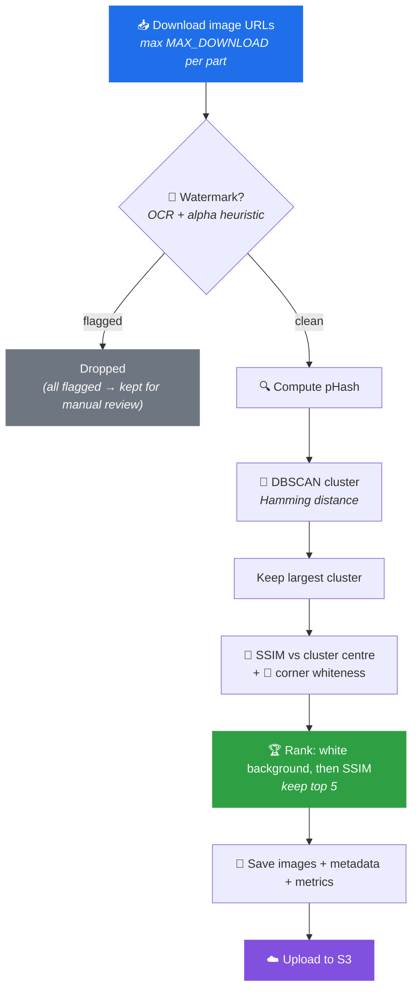

<div align="center">

# 🖼️ Image Analyzer

**Smart image filtering, deduplication and clustering for product catalogues.**

Feed it a list of image URLs for a part number — it downloads them, flags watermarks,
groups near-duplicates, scores background quality, and hands back only the frames
worth publishing.

[](LICENSE)
[](https://www.python.org/)
[](https://github.com/FETKlOkAn2/Image-Analyzer/actions)
[](https://github.com/astral-sh/ruff)
[](#-project-status)

[Quickstart](#-quickstart) · [How it works](#-how-it-works) · [Configuration](#️-configuration) · [Development](#-development) · [Responsible use](#️-responsible-use) · [Contributing](CONTRIBUTING.md)

</div>

---

## 🧩 The problem

Supplier image feeds are messy. The same part arrives as six copies of one photo at
different resolutions, two of them watermarked, one on a grey studio backdrop, one
that's a 404 page rendered as a JPEG. Uploading that raw into a catalogue produces
duplicate galleries and inconsistent product pages.

**Image Analyzer** is the pre-upload filter: it collapses the duplicates, drops the
watermarked frames, prefers clean white-background shots, and emits a metrics trail
so you can tune the thresholds against your own feed instead of guessing.

## ✨ Features

| | Capability | How |
|---|---|---|
| 📥 | **Batch download** | Fetches up to `MAX_DOWNLOAD` URLs per part with timeouts and per-URL error capture |
| 🚫 | **Watermark detection** | OCR heuristic over the bottom band via `pytesseract`, plus an alpha-channel overlay check |
| 🔍 | **Similarity scoring** | Perceptual hashing (`imagehash` pHash) + Structural Similarity Index (`scikit-image` SSIM) |
| 🧬 | **Near-duplicate clustering** | DBSCAN over Hamming distance of pHash bit vectors, keeping the largest cluster |
| 🎨 | **Background quality check** | Samples four corner patches for near-white brightness |
| 📊 | **Metrics & reporting** | Per-part JSON, a comprehensive run report, and a flat CSV for analysis |
| ☁️ | **S3 handoff** | `boto3` wiring to push the approved set to a bucket *(scaffolded — see [Project status](#-project-status))* |

## 🖥️ What the output looks like

Every kept image is written out three ways: the original, a machine-readable metadata
sidecar, and an annotated copy with the analysis decisions burned in — handy for
eyeballing *why* the pipeline made a call.

<div align="center">
<table>
<tr>
<td align="center"><strong>Input</strong></td>
<td align="center"><strong>Annotated decision</strong></td>
</tr>
<tr>
<td></td>
<td></td>
</tr>
</table>
</div>

```json
{
  "white_ok": true,
  "corner_means": [254.96, 255.0, 255.0, 255.0],
  "ssim_center": 1.0,
  "cluster": 0,
  "phash": "fe889dd9915f1ea44feaca37e727e077e0a2e0c0e689ce11f6157940f1a4c342",
  "watermark": false,
  "selected": true
}
```

## 🔄 How it works



**The selection logic in one sentence:** cluster away the near-duplicates, then within
the surviving cluster prefer images that both look like their peers (high SSIM) and sit
on a clean white background — with fallbacks at every stage so a part never ends up
with zero images just because a threshold was too tight.

## 🚀 Quickstart

### Prerequisites

Python 3.9+ and the **Tesseract OCR binary**, which `pytesseract` shells out to.
Without it, watermark detection degrades silently to "no watermark found" — the reason
is recorded in each metadata file as `ocr_error`, so check there if every image comes
back clean.

```bash
# macOS
brew install tesseract

# Debian / Ubuntu
sudo apt-get install -y tesseract-ocr

# Windows (winget)
winget install UB-Mannheim.TesseractOCR
```

### Install

```bash
git clone https://github.com/FETKlOkAn2/Image-Analyzer.git
cd Image-Analyzer
python3 -m venv venv && source venv/bin/activate   # Windows: venv\Scripts\activate
pip install -r requirements.txt
```

### Run the bundled demo

```bash
python image_analyzer.py
```

This processes three sample parts and writes results to `image_analysis_results/` and
`metrics/`. To inspect a single image step by step with verbose output:

```bash
python simple_analyzer.py
```

### Use it on your own data

```python
from image_analyzer import run_batch_analysis

parts = {
    "ATRTS38000": [
        "https://example.com/supplier-a/atrts38000-1.jpg",
        "https://example.com/supplier-a/atrts38000-2.jpg",
        "https://example.com/supplier-b/atrts38000.jpg",
    ],
}

results, summary = run_batch_analysis(parts, save_all_steps=True)

print(f"Download success rate: {summary['overview']['download_success_rate']:.1%}")
print(f"Images selected:       {summary['overview']['total_final_images']}")
```

`results` maps each part number to its selected images (with local paths, hashes and
scores) and its per-part metrics. `summary` carries the aggregate run statistics.

## ⚙️ Configuration

All tunables live in [`config.py`](config.py). The thresholds are the part worth
tuning — the defaults are a starting point, not a recommendation.

| Setting | Default | What it controls |
|---|---|---|
| `MAX_DOWNLOAD` | `20` | Hard cap on URLs fetched per part |
| `PHASH_SIZE` | `16` | pHash side length; higher = more sensitive to fine detail |
| `PHASH_SIM_THRESHOLD` | `6` | Max Hamming distance treated as "same image" (drives DBSCAN `eps`) |
| `SSIM_SIM_THRESHOLD` | `0.55` | Min structural similarity to the cluster centre |
| `WHITE_BG_THRESHOLD` | `245` | Corner brightness (0–255) above which a background counts as white |
| `MIN_IMAGES_AFTER_FILTER` | `1` | Floor below which filters are relaxed rather than returning nothing |
| `LOCAL_SAVE_DIR` | `image_analysis_results` | Where images and metadata are written |
| `METRICS_DIR` | `metrics` | Where per-part and run-level reports are written |

### AWS credentials

The S3 bucket is read from the environment — **never commit credentials or hardcode a
bucket name**:

```bash
export S3_BUCKET="my-catalogue-images"
```

Credentials themselves are resolved by `boto3` through the standard chain (environment
variables, `~/.aws/credentials`, or an instance/task role). See
[COMPLIANCE.md](COMPLIANCE.md) for the recommended IAM posture.

## 🧪 Development

```bash
pip install -r requirements.txt -r requirements-dev.txt
pytest          # 25 tests, all offline
ruff check .
```

The suite builds every image in memory and **never reaches the network** — fetching
third-party URLs from CI would be flaky and, per [COMPLIANCE.md](COMPLIANCE.md),
inappropriate. It covers the download error contract, perceptual-hash and SSIM
ordering, corner-whiteness thresholds, watermark-detection fallbacks and metrics
aggregation. Two tests need the Tesseract binary and skip cleanly without it.

CI runs the suite on Python 3.9, 3.11 and 3.12, lints with Ruff, and scans the diff
for committed secrets. See [CONTRIBUTING.md](CONTRIBUTING.md) for the full workflow.

## 📂 Project structure

```
Image-Analyzer/
├── image_analyzer.py        # Batch pipeline, metrics collection, reporting
├── simple_analyzer.py       # Single-image walkthrough for debugging thresholds
├── utils.py                 # Download, OCR, hashing, SSIM, corner check, saving
├── config.py                # Thresholds and paths
├── tests/                   # Offline test suite (no network calls)
├── docs/images/             # README assets
├── .github/workflows/ci.yml # Lint, tests on 3.9/3.11/3.12, secret scan
├── requirements.txt         # Runtime dependencies
├── requirements-dev.txt     # pytest, ruff
├── pyproject.toml           # Ruff and pytest configuration
├── image_analysis_results/  # Generated output (git-ignored)
└── metrics/                 # Generated reports (git-ignored)
```

Pipeline output is **not** version-controlled. Both directories are recreated on each
run.

## ⚖️ Responsible use

This tool detects and discards watermarked images, and it downloads images from
arbitrary URLs. That has legal weight, so to be explicit:

> **Intended use:** preparing product images that you own, or that a supplier has
> licensed you to publish, for your own catalogue.
>
> Watermark *detection* here exists to **reject** images you may not have the rights to
> use — not to launder them. Removing or circumventing a watermark on someone else's
> photograph in order to publish it is a copyright violation in most jurisdictions,
> and in the US may also implicate the DMCA's provisions on copyright management
> information. Don't use this for that.

Downloading also means respecting the source: honour `robots.txt` and terms of service,
rate-limit your requests, and keep the attribution trail — the pipeline records the
`original_url` for every selected image precisely so provenance survives.

Full detail on image rights, credential handling, data flow and the OCR boundary is in
**[COMPLIANCE.md](COMPLIANCE.md)**.

## 📌 Project status

**Prototype.** It runs end to end and produces useful metrics, but it is not yet
production-hardened. Known gaps, stated plainly:

- **S3 upload is scaffolded, not wired.** The `boto3` client is imported and configured
  but the upload call is commented out in `config.py`.
- **Watermark detection is a heuristic.** Character-count OCR over the bottom band
  produces both false positives (legitimate product labelling) and false negatives
  (centred translucent marks). A dedicated model would do better.
- **Tests cover the primitives, not the pipeline end to end.** The filters, hashing,
  SSIM and metrics aggregation are tested; `analyze_images_for_part()` itself has no
  integration test yet.
- **Corner-whiteness is a proxy** for background quality and misjudges images that are
  cropped tight to the product.
- **Thresholds are untuned** against any labelled dataset.

### Roadmap

- [ ] Wire and test the S3 upload path with a dry-run mode
- [x] `pytest` suite with synthetic fixture images covering each filter stage
- [ ] Integration test for `analyze_images_for_part()` with a mocked download layer
- [ ] CLI entry point (`argparse` / `typer`) instead of editing `__main__`
- [ ] Swap the OCR heuristic for a trained watermark classifier
- [ ] Concurrent downloads with a shared rate limiter
- [ ] Structured `logging` in place of `print`

## 🤝 Contributing

Contributions are welcome. See **[CONTRIBUTING.md](CONTRIBUTING.md)** for the
development setup, code style and PR process, and **[CODE_OF_CONDUCT.md](CODE_OF_CONDUCT.md)**
for community expectations. To report a vulnerability, follow
**[SECURITY.md](SECURITY.md)** rather than opening a public issue.

## 🛠️ Tech stack

`Python` · `pytesseract` · `imagehash` · `scikit-image` · `scikit-learn` · `OpenCV` ·
`Pillow` · `pandas` · `NumPy` · `boto3` · `requests`

## 📄 License

Released under the [MIT License](LICENSE). © 2025 Tomáš Maxim.

Demo images in `docs/images/` are derived from photographs on
[Unsplash](https://unsplash.com/), used under the
[Unsplash License](https://unsplash.com/license).

---

<div align="center">
<sub>Built by <a href="https://github.com/FETKlOkAn2">@FETKlOkAn2</a> · If this was useful, a ⭐ helps.</sub>
</div>
